# FlavourFusion:

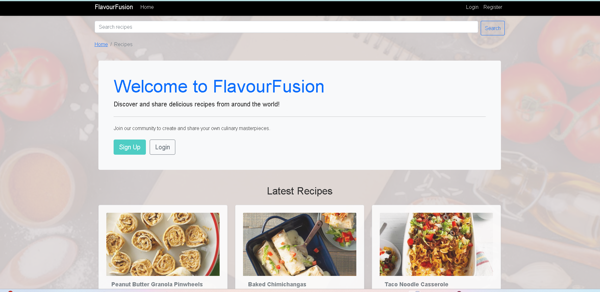

**FlavourFusion**: Is a dynamic, user-friendly recipe sharing platform built with Django. It allows food enthusiasts to create, share, and discover delicious recipes from around the world.
The application emphasizes user experience, allowing for seamless recipe uploads complete with ingredients, step-by-step instructions, and high-quality images. By fostering interaction through ratings and comments, FlavourFusion creates a vibrant, interactive culinary community.
## Key Features

- **User Authentication**: Secure user registration and login system.
- **Recipe Management**: Users can create, view, edit, and delete their own recipes.
- **Recipe Sharing**: All users can view recipes shared by others.
- **Ingredient and Preparation Steps**: Detailed recipe information including ingredients list and step-by-step preparation instructions.
- **Image Upload**: Users can upload images for their recipes, making the platform visually appealing.
- **Rating System**: Users can rate and comment on recipes, providing valuable feedback.
- **Search Functionality**: Easy-to-use search feature to find recipes quickly.
- **User Profiles**: Personalized user profiles showcasing their recipes and activity.
- **Responsive Design**: The platform is fully responsive, ensuring a great experience on both desktop and mobile devices.
 
 **The live application can be viewed here:** 

https://flavour-fusion-6b3b000f2d22.herokuapp.com/

# Purpose and Target Audience:

**Problem Statement:** Many cooking enthusiasts struggle to find a centralized platform to share their recipes, discover new dishes, and engage with a community of like-minded food lovers. Existing solutions often lack user-friendly interfaces or comprehensive features that cater to both amateur and experienced cooks.

**Purpose:** FlavourFusion is a recipe sharing application designed to connect food enthusiasts worldwide. It provides a platform for users to easily create, share, and discover recipes. The app allows users to upload their culinary creations, complete with ingredients, preparation steps, and images. Users can also rate and comment on recipes, fostering a vibrant community of food lovers.

**Target Audience:** FlavourFusion caters to a diverse group of food enthusiasts, including:
1. Home cooks seeking inspiration for their next meal
2. Food bloggers looking to expand their reach and engage with a broader audience
3. Culinary students eager to share their learning and discover professional techniques
4. Health-conscious individuals exploring nutritious recipe options
5. Cultural food enthusiasts interested in authentic recipes from around the world
6. Busy professionals searching for quick and easy meal ideas
7. Experimental cooks who enjoy fusion cuisine and novel flavor combinations

FlavourFusion aims to create an inclusive community where novice cooks can learn from experienced chefs, food enthusiasts can showcase their creativity, and everyone can explore diverse cuisines from around the world.

# Persona and User Stories:
Maria is a passionate home cook who loves experimenting with different cuisines and flavors. She spends most of her free time in the kitchen, trying out new recipes and perfecting old ones. Maria is always eager to share her culinary creations with others and learn from fellow food enthusiasts. She recently discovered FlavourFusion and is excited about the possibility of connecting with a broader cooking community.
## User Stories:

* As a home cook, I want to be able to browse a wide variety of recipes before deciding what to cook, so I can find inspiration for my next meal.
* As a user, I want to be able to add my own recipes to the collection, complete with ingredients, instructions, and photos, so that other users can try my culinary creations.
* As a food enthusiast, I want to create an account so that I can save my favorite recipes, rate dishes, and interact with other users.
* As a health-conscious individual, I want to be able to filter recipes based on dietary requirements (e.g., vegetarian, gluten-free, low-carb), so I can find meals that fit my lifestyle.
* As a user, I want to be able to edit and delete recipes that I have added, so that I can keep my contributions up-to-date and accurate.
* As a culinary student, I want to explore recipes from different cuisines, so that I can broaden my cooking skills and knowledge.
* As a user, I want to be able to read detailed information about a recipe, including preparation time, difficulty level, and user ratings, so that I can decide if it's suitable for my skill level and time constraints.
* As an experienced cook, I want to be able to leave comments and suggestions on recipes, so that I can share my tips and help others improve their cooking.
* As an admin, I want to be able to moderate recipe submissions and user comments, so that I can ensure the content is appropriate and maintains the quality of the platform.
* As a busy professional, I want to save money on dining out by finding quick and easy recipes to cook at home, so that I can enjoy good food while saving for other priorities.
* As a food blogger, I want to be able to share my recipes on FlavourFusion and link back to my blog, so that I can increase my visibility and engage with a larger audience.

## Wireframe & Initial Design:
### Landing Page Laptop
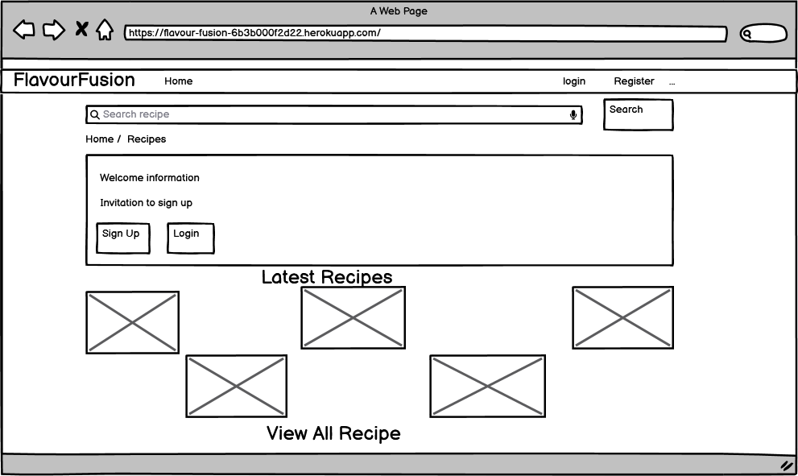

### Landing Page mobile 
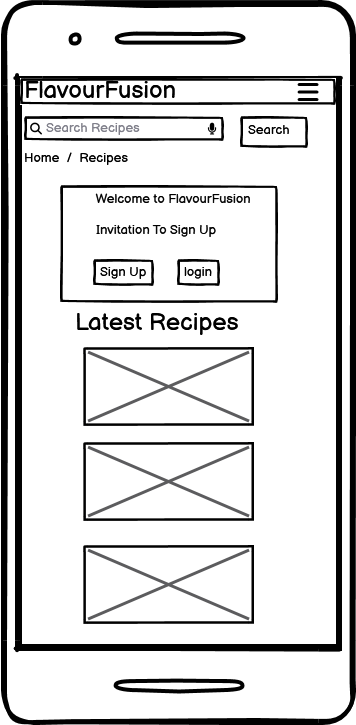

### Landing Page mobile (Expanded hamgurger button)
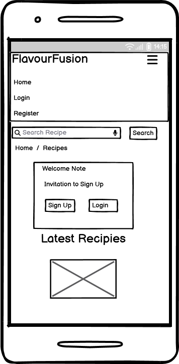

### Signed In Page
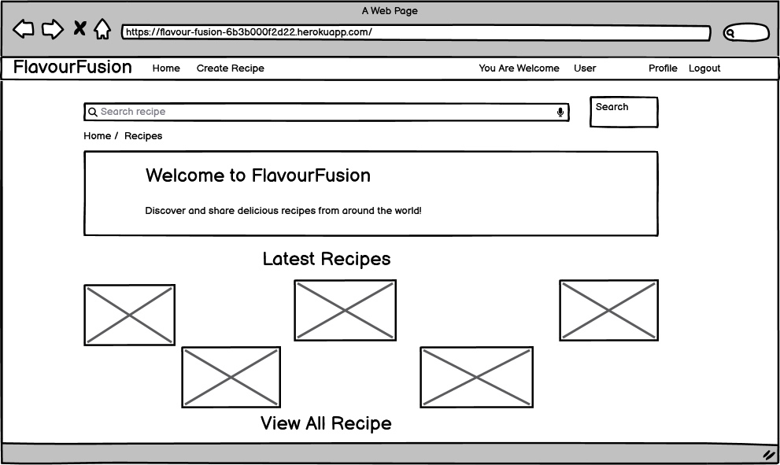

### Signed In Page Mobile
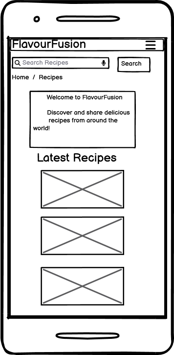

### User Profile Page
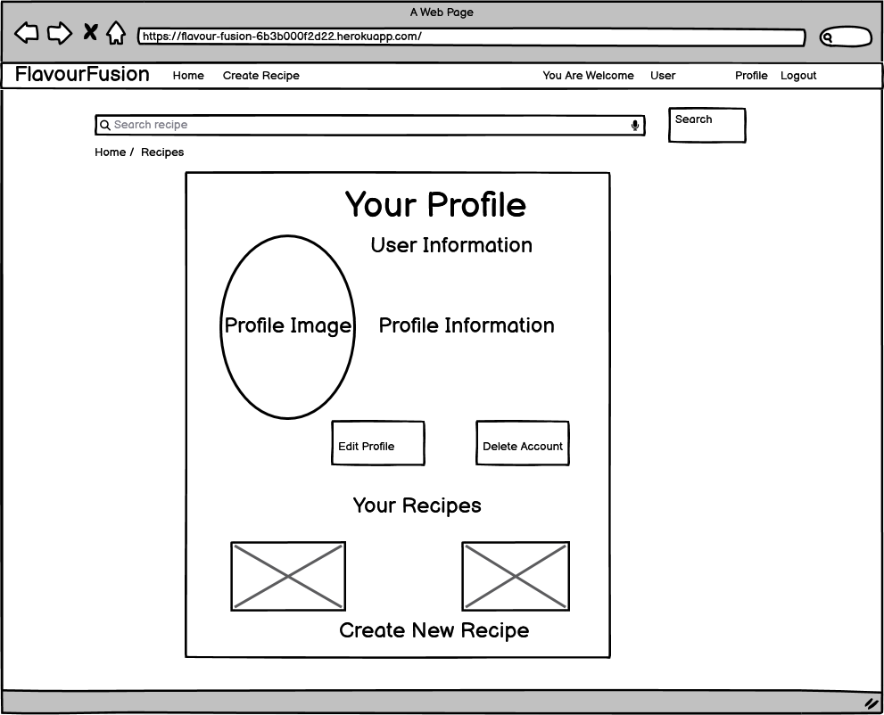

### Book Detail Page

### User Profile Page
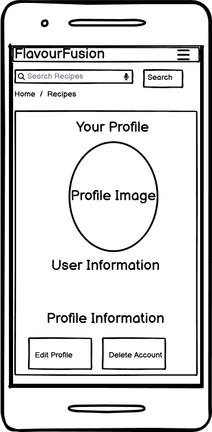
# Agile Methodology Implementation

This project was created using Agile principles via a project board on Github. While I have experience with Agile methodology from previous projects, this marks my first time applying these principles as an individual developer. I found that creating user stories and identifying acceptance criteria served as an invaluable roadmap, guiding the development of various features and functionalities within FlavourFusion. This approach helped me stay on track and reduced distractions, proving to be highly effective even in a solo development context.

## User Stories to Issues

I began by translating user stories into concrete Github issues. This process helped me break down the project into manageable tasks and prioritize features based on user needs. For instance, the user story "As a home cook, I want to be able to add my own recipes to the collection" was transformed into specific issues like "Implement recipe creation form" and "Set up database model for recipes".

## Acceptance Criteria

For each issue, I defined clear acceptance criteria. This step was crucial in providing a clear definition of "done" for each task. It helped me focus on the essential requirements and avoid scope creep. For example, for the "Implement recipe creation form" issue, acceptance criteria included fields for title, ingredients, instructions, and image upload, along with proper form validation.

## Github Project Board

I utilized Github's project board feature to organize my workflow. Issues were categorized into columns such as "To Do", "In Progress", and "Done". This visual representation of the project's status helped me prioritize tasks and maintain a steady development pace.

## Linking Issues to Commits

As a solo developer, I didn't create separate branches for each feature. Instead, I linked issues directly to the repository. This was done through GitHub's interface, which allows issues to be associated with the project repository. While I didn't explicitly reference issues in commit messages, the direct linking of issues to the repository helped maintain a clear connection between the project board tasks and the codebase.

## Benefits of the Agile Approach

Implementing these Agile practices, even as a solo developer, proved highly beneficial:

1. It helped me stay focused on user needs throughout the development process.
2. Breaking down the project into smaller, manageable tasks made the overall development less overwhelming.
3. Regular reviews of the project board allowed me to adapt to changing requirements efficiently.
4. The clear structure reduced distractions and kept me on track with project goals.
5. Linking issues to commits provided a clear history of feature implementation and problem-solving.

While this was my first time implementing Agile as an individual developer, I found the experience extremely valuable. It provided a structured approach to development, ensuring that FlavourFusion evolved in a way that consistently aligned with user needs and project goals. The project board served as a personal kanban board, helping me visualize my progress and manage my workload effectively.

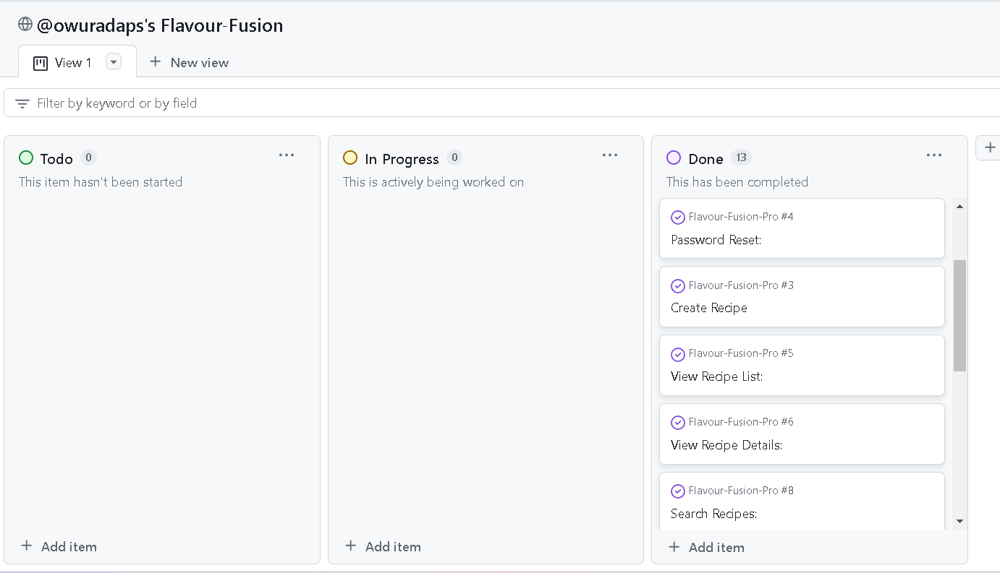

# Design Choices

FlavourFusion's design is crafted to create an inviting and user-friendly environment for food enthusiasts. The aesthetic choices reflect the warmth of a shared kitchen while maintaining a modern, clean interface.

## Background
The site features a full-screen background image (bg-recipe1.avif) that sets a culinary tone. This image is fixed and covers the entire viewport, creating depth and context for the content. A semi-transparent overlay (rgba(222, 217, 217, 0.9)) is applied to ensure readability of the content while preserving the warmth of the background image.

## Color Palette
The color scheme is built around neutral tones that complement the background image. Teal accents (#4ecdc4) are used for interactive elements, adding vibrancy and guiding user interactions. White (#ffffff) is used for card backgrounds, creating clean spaces for content display.

## Typography
Clean, sans-serif fonts (Arial) are used throughout the site for optimal readability across devices. Headings are bold and slightly larger to create clear hierarchies in content presentation.

## Layout
A responsive grid system ensures that content is accessible and well-organized on both desktop and mobile devices. Cards with subtle hover effects (increasing opacity and adding a shadow) are used to display recipes, creating a visually appealing and interactive browsing experience.

## User Interface
Interactive elements are designed with clear visual feedback, using color changes and subtle animations to guide users. The navbar and footer use a solid black background (#000000), providing a strong frame for the content and ensuring good contrast for navigation elements.

## Accessibility
The design considers accessibility, with contrasting colors for text and background elements. The semi-transparent overlay on the background image ensures that text remains readable regardless of the image content beneath.

These design choices aim to create a platform that is not only functional but also visually appealing and enjoyable for users to explore and share their culinary passions. The overall effect is a warm, inviting space that puts the focus on the food and recipes shared by the community.

## Priority Features:

### Home Page:

#### Navbar & Hero Image unregistered user view:
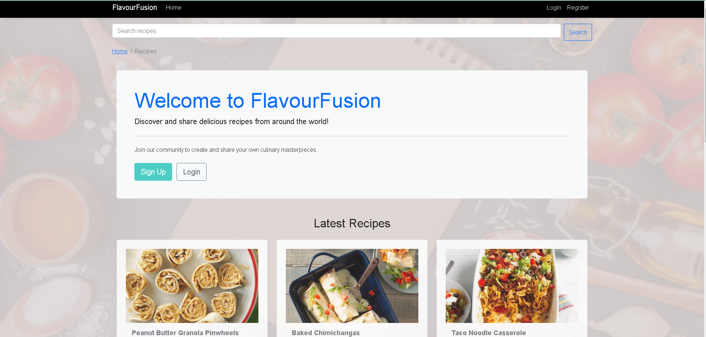

#### Navbar & Hero Image Signed In user view:
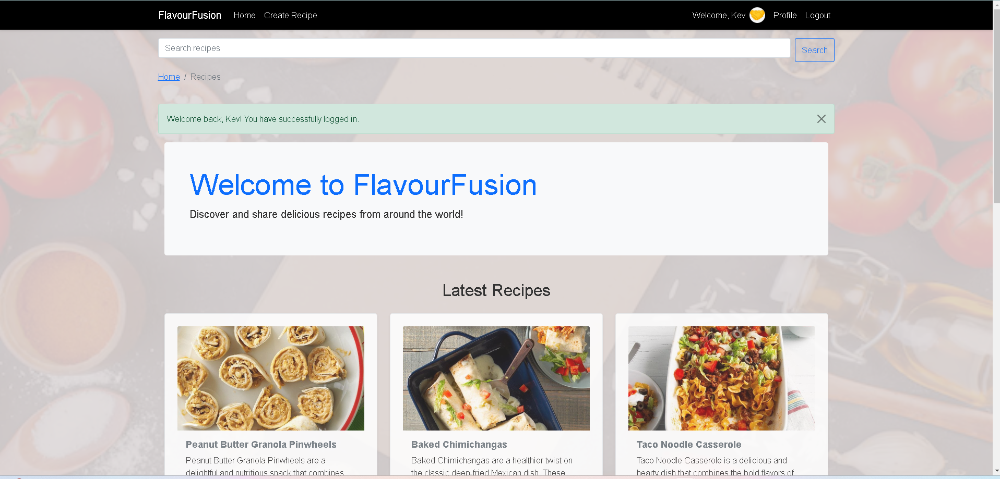

# Landing Page Description

The FlavourFusion landing page serves as an inviting gateway to the recipe-sharing community. It's designed to immediately engage visitors and showcase the diverse culinary creations of our users, while also encouraging new users to join the community.

## For Non-Registered/Non-Logged In Users

### Header
- A responsive navigation bar at the top of the page includes:
  - FlavourFusion brand name
  - Links to Home, Login, and Register
- The "Create Recipe" option is not visible to encourage sign-up

### Hero Section
- Features a prominent search bar, allowing all visitors to immediately search for recipes
- The search functionality supports queries for recipe titles, ingredients, or categories
- A welcoming message or tagline that encourages joining the community might be displayed

### Recipe Showcase
- A grid layout displays recipe cards, each featuring:
  - An appetizing image of the dish
  - Recipe title
  - Brief description (truncated for space)
  - Average rating displayed with star icons
  - "View Recipe" button for easy access to full details
- Non-logged in users can view recipes but cannot rate, comment, or save them

### Call-to-Action
- Prominent "Join Now" or "Sign Up" buttons are strategically placed to encourage registration
- Brief highlights of benefits for registered users (e.g., "Share your own recipes", "Save favorites")

### Limited Interaction
- While able to view and search recipes, non-registered users will see prompts to log in or register when attempting to:
  - Rate a recipe
  - Leave a comment
  - Save a recipe to favorites
  - Create a new recipe

## Responsive Design
- The layout adjusts seamlessly for optimal viewing on desktop, tablet, and mobile devices
- On smaller screens, the recipe grid transitions to a single column for easy scrolling

## User Interaction
- Recipe cards have a hover effect, slightly elevating and increasing opacity for a more engaging experience
- Each card links directly to the full recipe details page

## Background
- A full-width, fixed culinary-themed background image sets the tone for the site
- A semi-transparent overlay ensures readability of content over the background

## Pagination
- If the number of recipes exceeds the initial load, pagination controls are available for browsing additional pages of recipes

This landing page is designed to be welcoming and functional for all visitors, while also highlighting the benefits of joining the FlavourFusion community. It provides a taste of what the platform offers, encouraging new users to register and become active participants in the culinary sharing experience.

#### Registration:

Registration allows users to view the available books and the relevant book details at The Book Booth library. It allows them to add a book as well as edit and delete their addition to ensure the book collection available is updated regularly. 

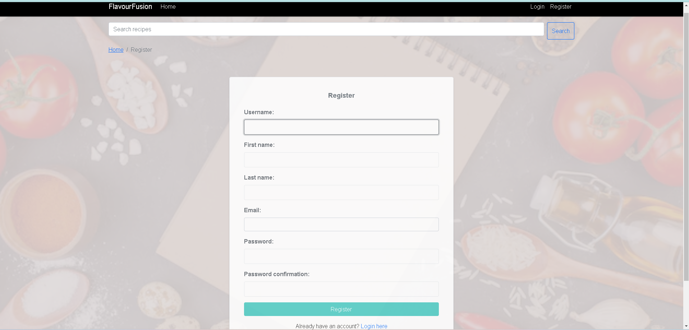

#### Sign In:

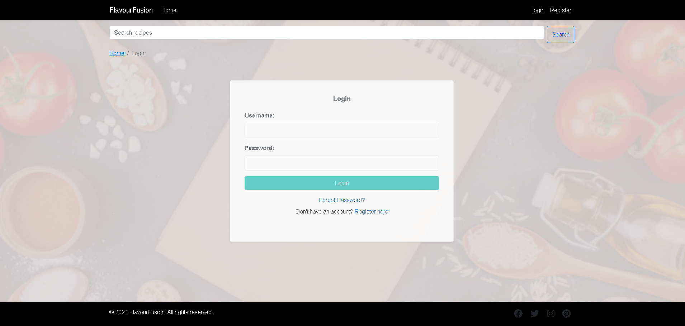

#### Recipes:

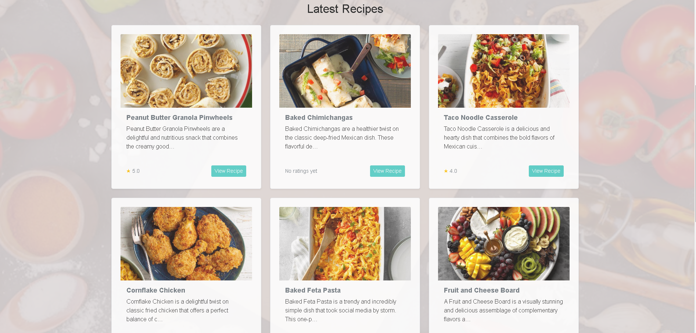

#### More Recipes:

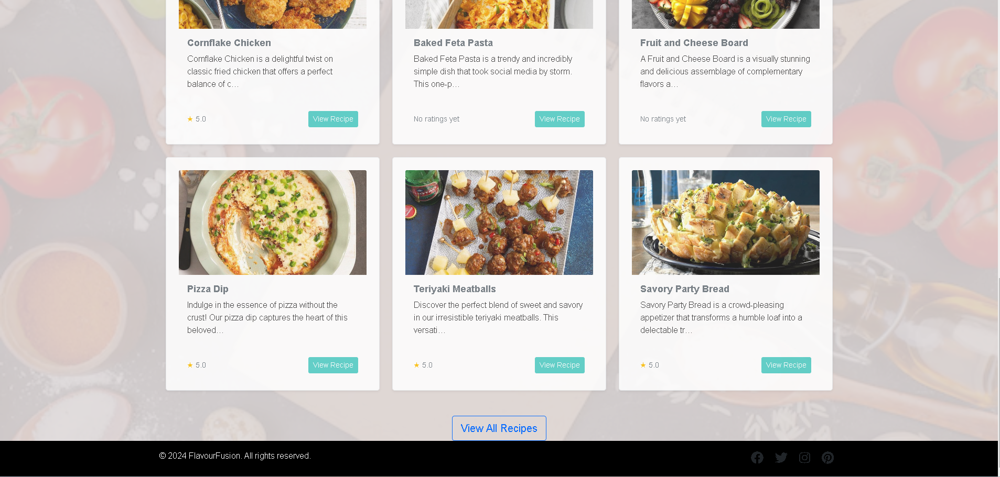

#### User Profile:

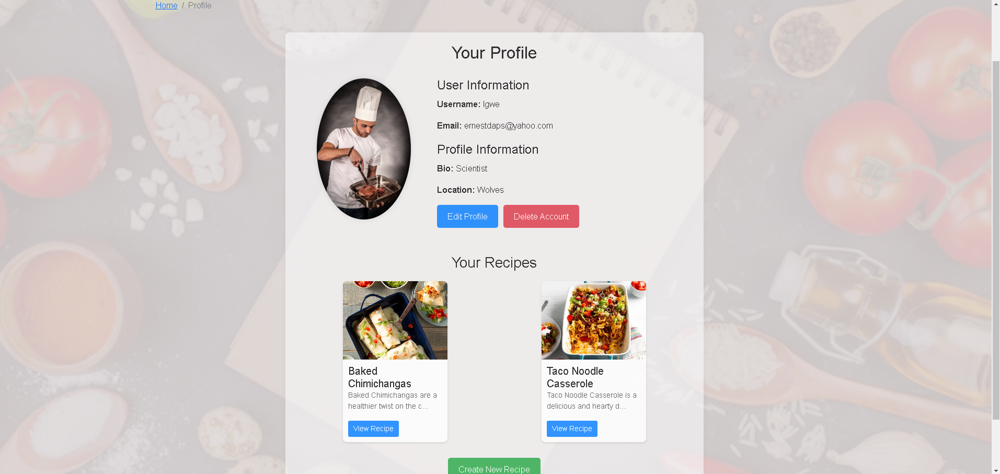

#### Edit profile:

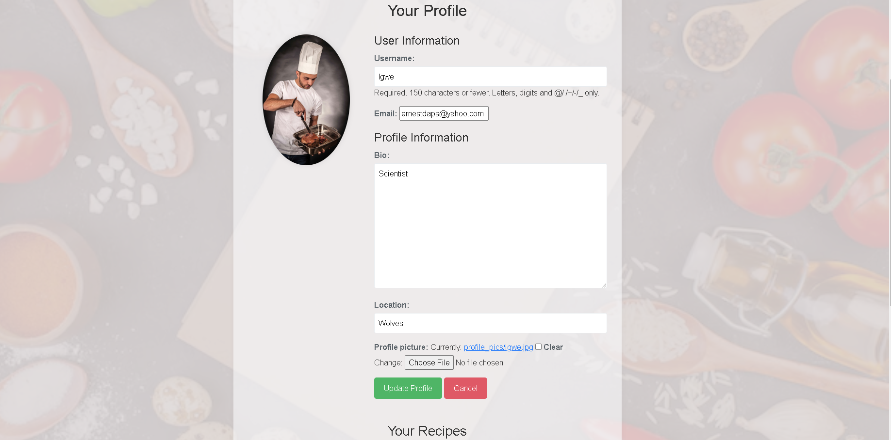

#### Create Recipe:

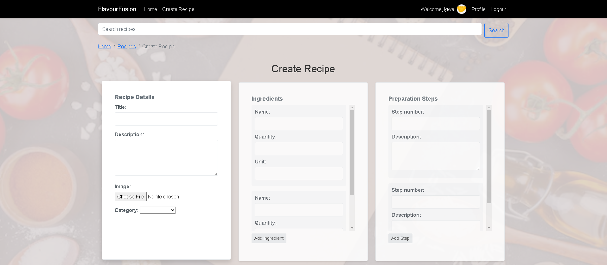

The Create Recipe form provides an intuitive interface for users to share their culinary creations. Key features include:

- Detailed recipe information input (title, description, category)
- Image upload capability for visual appeal
- Dynamic ingredient addition with quantity and unit specifications
- Step-by-step preparation instructions with an easy-to-use interface
- Real-time form validation to ensure all necessary information is provided

#### Edit Recipe:

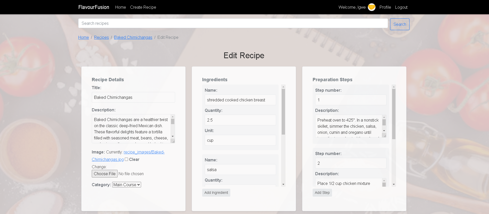

The Edit Recipe form allows users to modify their existing recipes. It offers:

- Pre-populated fields with current recipe data for easy editing
- Ability to update all aspects of the recipe, including title, description, and image
- Options to add, remove, or modify ingredients and preparation steps
- Same user-friendly interface as the Create Recipe form for consistency

#### Recipe Details:

FlavourFusion offers a comprehensive recipe viewing experience, tailored to both unregistered visitors and logged-in users.

### For Unregistered Users

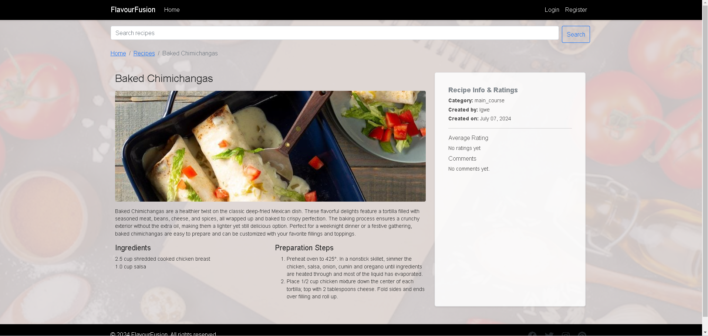

Unregistered users can explore the diverse world of recipes on FlavourFusion with access to:

- Full recipe details including title, description, and category
- High-quality images of the finished dish
- Complete list of ingredients with quantities
- Step-by-step preparation instructions
- View average ratings and read comments from the community

This open access encourages new visitors to explore the site's content and consider joining the FlavourFusion community.

### For Logged-In Users

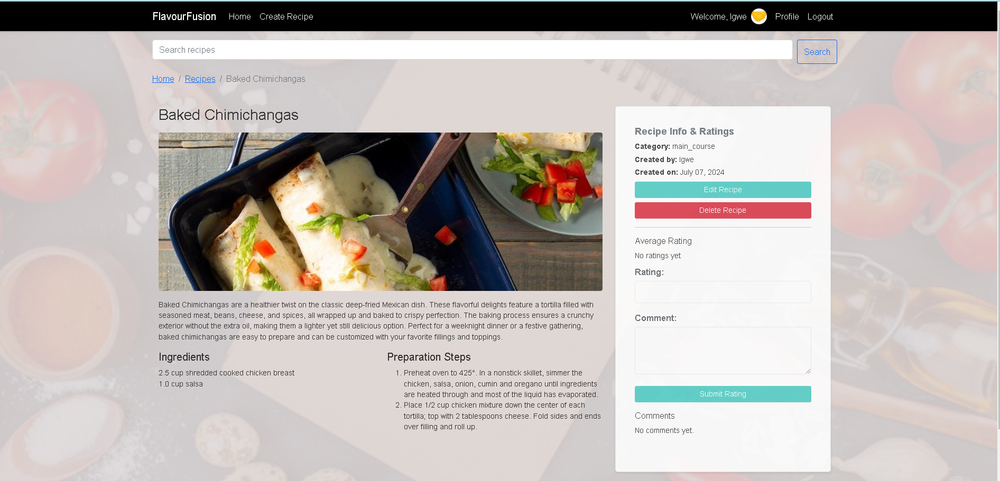

Registered users enjoy an enhanced experience with additional features:

- All features available to unregistered users
- Ability to rate recipes and leave comments
- Edit and delete their own recipes
Logged-in users can fully engage with the community, sharing their culinary experiences and building their own collection of favorite recipes.

## Footer:

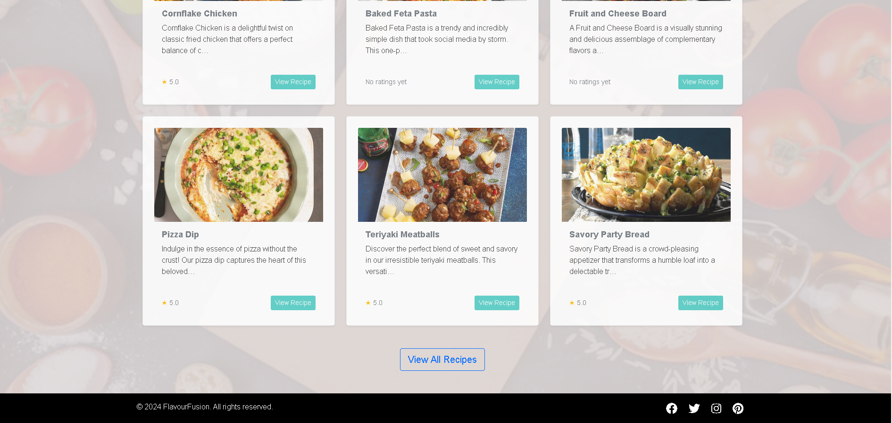

The footer of FlavourFusion serves as a consistent and accessible element across all pages, providing essential links and information to users.

### Key Features:

1. **Copyright Information**: 
   Displays the current year and FlavourFusion's copyright notice, ensuring legal protection of the site's content.

2. **Social Media Integration**:
   - Prominently featured social media icons for Facebook, Twitter, Instagram, and Pinterest.
   - Icons are designed for high visibility with a hover effect for enhanced user interaction.
   - Direct links to FlavourFusion's social media profiles, opening in new tabs for seamless navigation.

3. **Responsive Design**:
   - Adapts to various screen sizes, ensuring a consistent look on both desktop and mobile devices.
   - On smaller screens, content stacks vertically for improved readability.

4. **Visual Consistency**:
   - Maintains the site's color scheme, contributing to overall design cohesion.
   - Contrasting background color helps separate the footer from the main content area.

5. **Accessibility**:
   - Social media icons include hidden text for screen readers, improving site accessibility.

The footer design emphasizes user engagement by encouraging social media interaction while maintaining a clean, professional appearance. It serves as a final touchpoint for users, reinforcing the FlavourFusion brand and providing easy access to extended content on social platforms.

## Database Schema / Entity-Relationship Diagram

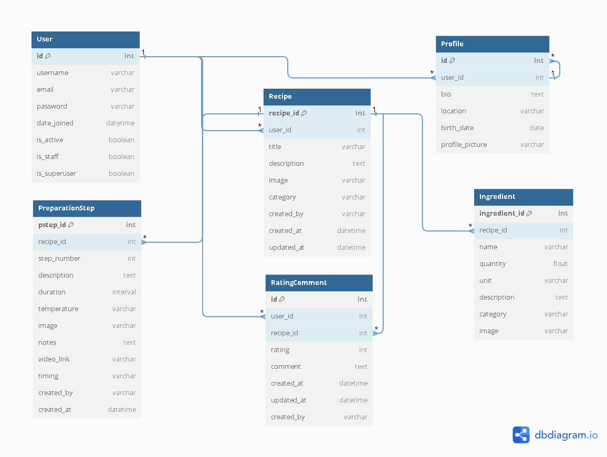

The FlavourFusion project utilizes a robust and interconnected database schema to efficiently manage user data, recipes, and interactions. Our Entity-Relationship Diagram (ERD) illustrates the structure and relationships of our PostgreSQL database.

Key Components:

1. **User Management**:
   - User table stores essential account information.
   - Profile table extends user data with additional details.
   - UserProfile manages user relationships and preferences.

2. **Recipe Structure**:
   - Recipe table is the core, linking to users who create them.
   - Ingredient and PreparationStep tables break down recipe components.

3. **User Interactions**:
   - RatingComment table allows users to rate and comment on recipes.
   - UserProfile_followers tracks user-to-user follows.
   - UserProfile_favorite_recipes manages users' recipe bookmarks.

4. **Relationships**:
   - One-to-One: User to Profile
   - One-to-Many: User to Recipe, Recipe to Ingredient/PreparationStep
   - Many-to-Many: Users following other Users, Users favoriting Recipes

This schema ensures efficient data retrieval and maintains data integrity across the application. It supports key features like recipe creation, user interactions, and personalized content, forming the backbone of FlavourFusion's functionality.

## Data Models:

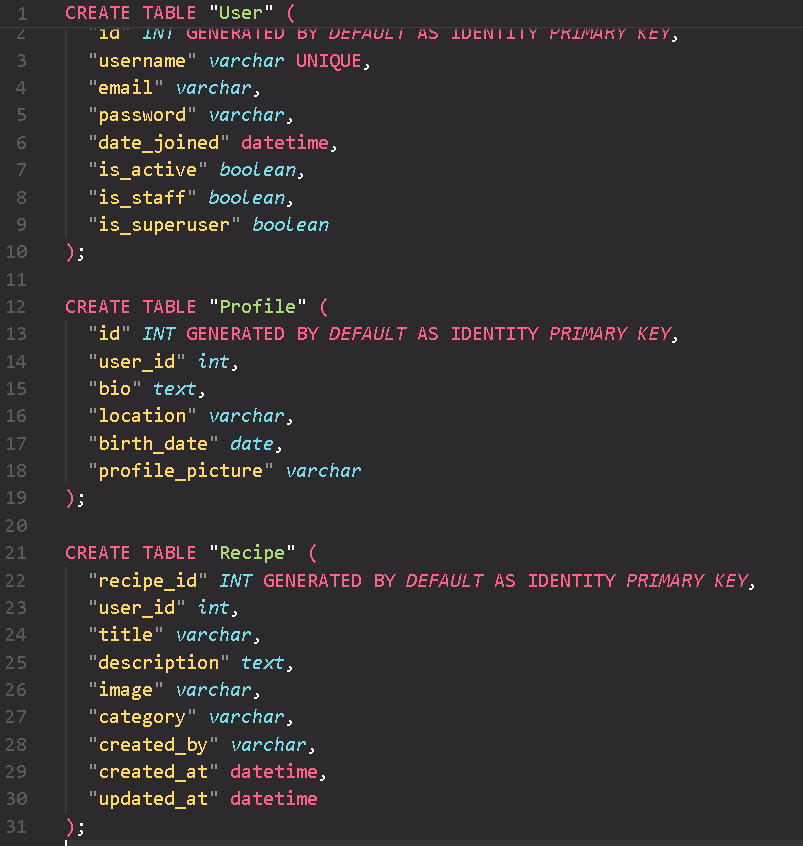

## User Flow Chart:
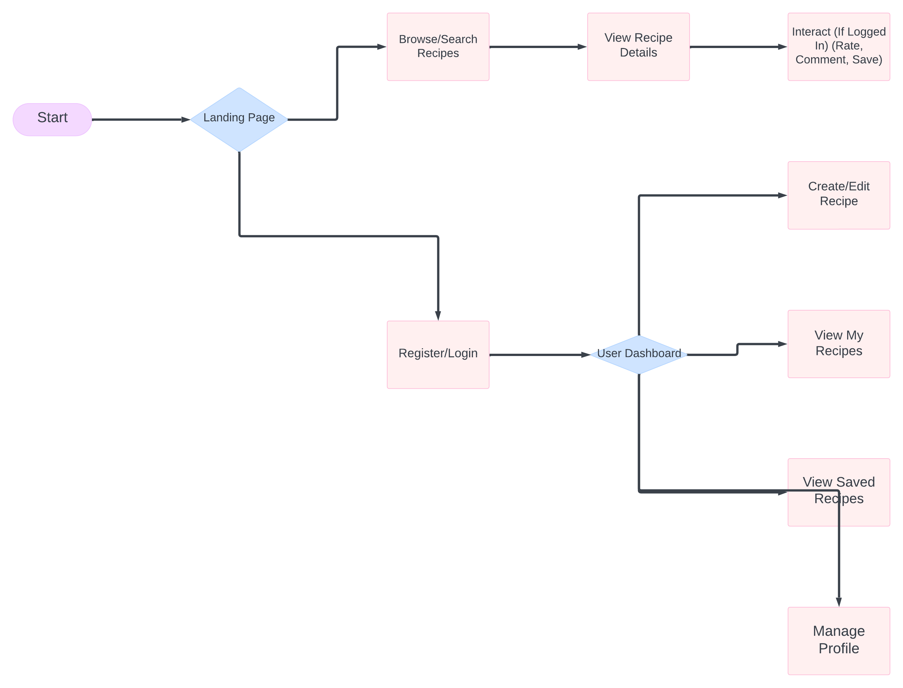
## User Flow Chart

FlavourFusion offers a straightforward user experience, enhanced by a breadcrumb navigation system for easy orientation:

1. **Recipe Discovery**: 
   - Users can browse or search for recipes from the landing page.
   - Breadcrumbs: Home > Browse Recipes or Home > Search Results

2. **Recipe Viewing**:
   - Users can access detailed recipe views.
   - Breadcrumbs: Home > Recipe Category > Recipe Name

3. **Recipe Interaction**: 
   - Logged-in users can rate, comment on, and save recipes they like.
   - Breadcrumbs remain consistent: Home > Recipe Category > Recipe Name

4. **User Authentication**: 
   - New users can register, while returning users can log in to access personalized features.
   - Breadcrumbs: Home > Login or Home > Register

5. **User Dashboard**: The central hub for logged-in users, providing access to:
   - Recipe creation and editing
     Breadcrumbs: Home > Dashboard > Create Recipe or Edit Recipe
   - Profile management
     Breadcrumbs: Home > Dashboard > Edit Profile
   - Personal recipe collection
     Breadcrumbs: Home > Dashboard > My Recipes
   - Saved favorite recipes
     Breadcrumbs: Home > Dashboard > Saved Recipes

The breadcrumb navigation feature enhances user experience by:
- Providing clear context of the user's location within the site structure
- Offering easy navigation to higher-level pages
- Improving overall site usability and reducing the number of clicks for navigation

This streamlined flow, combined with the breadcrumb system, ensures users can easily navigate between discovering new recipes and managing their own contributions to the FlavourFusion community, always aware of their location within the site.

[Insert simplified flow chart image here]

# Validation
## HTML

| Page | W3C URL | Screenshot | Notes |
| --- | --- | --- | --- |
| Home | [W3C](https://validator.w3.org/nu/?doc=https%3A%2F%2Fthebookbooth1-559d9131718c.herokuapp.com%2F) |  | Pass: button is a descendant of a tag |
| Books | [W3C](https://validator.w3.org/nu/?doc=https%3A%2F%2Fthebookbooth1-559d9131718c.herokuapp.com%2Fbooks%2Fbooks%2F) |  | Pass: No Errors |
| Add a Book | [W3C](https://validator.w3.org/nu/?doc=https%3A%2F%2Fthebookbooth1-559d9131718c.herokuapp.com%2Fbooks%2Fadd_book%2F) |  | Pass: No Errors |
| Sign In| [W3C](https://validator.w3.org/nu/?doc=https%3A%2F%2Fthebookbooth1-559d9131718c.herokuapp.com%2Faccounts%2Flogin%2F) |  | Pass: No Errors |
| Register| [W3C](https://validator.w3.org/nu/?doc=https%3A%2F%2Fthebookbooth1-559d9131718c.herokuapp.com%2Faccounts%2Fsignup%2F) |  | unclosed elements main and div |

 ## CSS

 I have used the recommended [CSS Jigsaw Validator](https://jigsaw.w3.org/css-validator) to validate my CSS file.
 
| File | Jigsaw URL | Screenshot | Notes |
| --- | --- | --- | --- |
| style.css | [Jigsaw](https://jigsaw.w3.org/css-validator/validator?uri=https%3A%2F%2Fthebookbooth1-559d9131718c.herokuapp.com%2F&profile=css3svg&usermedium=all&warning=1&vextwarning=&lang=enhttps://jigsaw.w3.org/css-validator/validator) |  | Pass: No Errors |

## Python

I have used the recommended [PEP8 CI Python Linter](https://pep8ci.herokuapp.com) to validate all of my Python files.

| File | CI URL | Screenshot | Notes |
| --- | --- | --- | --- |
| forms.py | [PEP8 CI](https://pep8ci.herokuapp.com/https://raw.githubusercontent.com/hiboibrahim/thebookbooth1/main/run.py) | ![screenshot]
 | Pass: No Errors |
| settings.py | [PEP8 CI](https://pep8ci.herokuapp.com/https://raw.githubusercontent.com/hiboibrahim/thebookbooth1/main/boutique-ado/settings.py) | ![screenshot]
 | Pass: No Errors |
| Book views.py | [PEP8 CI](https://pep8ci.herokuapp.com/https://raw.githubusercontent.com/hiboibrahim/thebookbooth1/main/blog/views.py) | ![screenshot]
 | Pass: No Errors |
| Book urls.py | [PEP8 CI](https://pep8ci.herokuapp.com/https://raw.githubusercontent.com/hiboibrahim/thebookbooth1/main/checkout/urls.py) | ![screenshot]
 | Pass: No Errors |
|  models.py | [PEP8 CI](https://pep8ci.herokuapp.com/https://raw.githubusercontent.com/hiboibrahim/thebookbooth1/main/profiles/models.py) | ![screenshot]
 | Pass: No Errors |

# Responsiveness:
Development tools were used to test responsiveness on varying sized devices including laptop, mobile and tablet size.

Full testing was performed on the following devices:

Laptops:

* Macbook Air 2018 13.3-inch screen
* Lenovo Thinkpad 14" screen

 Mobile Devices:
* Google Pixel 4a

 * Browser Compatibility:
 
 I have tested the site using the following browsers:

* Google Chrome

* Microsoft Edge

I can confirm that the site is responsive and looks as expected good on different screen sizes.

Mobile devices:

Tablet Devices:

# Testing:

## Lighthouse Audit:

I've tested my deployed project using the Lighthouse Audit tool to check for any major issues.

* On a laptop:

Home

Books 

Add a book 

On a mobile device:

Home 

Books

Add a book 

## Links

| Link | Expected Outcome | Grade |
| ------- | ---------------- | ----- |
| Logo | Navigates to the home page when clicked | Fail |
| Home | Navigates to the home page when clicked | Pass |
| Books | Navigates to a book list  page when clicked | Pass |
| Add a Book | Navigates to a form to add a book when clicked | Pass |
| Register | Navigates to a registration form when clicked | Pass |
| Log in | Navigates to a screen where users can log in when clicked | Pass |
| Logout | Navigates to a page confirming for the user to log out | Pass |

## Testing 

| Feature | Expected Outcome | Grade | Screenshots |
| ------- | ---------------- | ----- | --------- |
| Modal | A message will appear informing the user of a successful action | Pass | 
| User logged in | Text displays the user logged in with their username | Pass | 
| View books | Users can see available books which have been added | Pass | 
| Add a book | Add a book to the book collection that will be available to borrow | Pass | 
| Admin has access to crud functionality of all additions | Admin can edit or delete any book addition | Pass | 
| Edit a book | A user can edit the details on the book that they have addded. It will update their addition on the books page | Pass | 
| Delete a book | A user who added a book OR an admin can delete a book. It will then be deleted from the DB | Pass | 
| Registration | New users can access a registration form from the "Register" link | Pass | 
| Log in | Users can log in using a form after clicking "Log in" | Pass | 
| Log out | Users get logged out after clicking "Log out" | Pass | 
| Grid display | A CSS grid will display the books in a clear, responsive format | Pass | N/A
| Functional buttons | Edit, delete, create buttons will be functional throughout the site | Pass | 
| Footer | A footer displays social information | Pass | 
| Social links work | The social links will navigate to a new page when they're clicked. They will open in a new tab | Pass | 

# Tools and Technologies Used:
The technologies implemented in this application included HTML5, CSS, Bootstrap, Python and Django.

* Python used as the back-end programming language.
* Git used for version control. (git add, git commit, git push)
* GitHub used for secure online code storage.
* GitHub Pages used for hosting the deployed front-end site.
* Gitpod used as a cloud-based IDE for development.
* Bootstrap used as the front-end CSS framework for modern responsiveness and pre-built components.
* ElephantSQL used as the Postgres database.
* Heroku used for hosting the deployed back-end site.
* Cloudinary used for online static file storage.
* Canva Utilized for collaborative design and prototyping(wireframes).

* Google and Stack Overflow utilized for general research or solving a bug, information gathering, and various online tools.

# Languages Used:
* HTML5
* CSS
* Python

# Deployment :

I used the steps used when deploying our django blog to deploy this application. The instructions for this mainly came from the follow along videos and text-steps provided on the code institute LMS.

# Bugs

All the bugs that occured during the creation of this application have been resolved. There is a section of the application which allows you to reset your password that needs to be implemented, however they were not within the scope of this particular project and will be addressed in the near future along with the other future features.

# Credit: 

* Although I used the django blog resources provided on the LMS, I also received alot of additional clarification by following along with django projects on YouTube. One of the vidoes I found especially helpful was : https://youtu.be/JzDBCZTgVyw?si=w3BBwJswUjBTm1xw

* Stack Overflow was used to solve any smaller bugs and further clarification on errors I was receiving in the terminal.

* I used this site to generate a persona and created user stories: https://founderpal.ai/user-persona-generator

* A special thanks to all the other indivudals in our cohort for their continuous support throughout the course.

* The added book covers and details were taken from the Waterstones Website.

* Font Awesome was used for icons and the fonts used were derived from Google Fonts.

* Wireframes, logo and flowcharts were created using Canva. 
